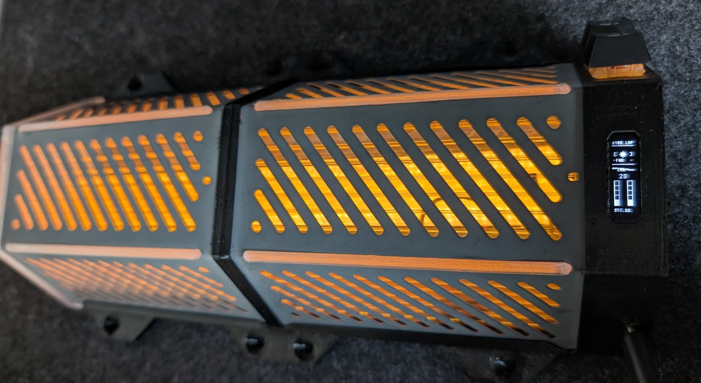

# CYBR.LMP // SYSTEM_MANUAL

```
   ______   __  __   ______   ______       __       __    __   ______
  /\  ___\ /\ \_\ \ /\  == \ /\  == \     /\ \     /\ "-.-\ \ /\  == \
  \ \ \____\ \____ \\ \  __< \ \  __<     \ \ \____\ \ \-.-\ \ \  _-/
   \ \_____\\/\_____\\ \_____\\ \_\ \_\    \ \_____\\ \_\ \"\_\\ \_\
    \/_____/ \/_____/ \/_____/ \/_/ /_/     \/_____/ \/_/  \/_/ \/_/
```

` > INITIALIZING CONNECTION...`
` > DECRYPTING DATA STREAM...`
` > ACCESS GRANTED.`




## [ SYSTEM_MANIFEST ]

The **CYBR.LMP** is a high-fidelity illumination construct designed for the discerning netrunner. Powered by an **RP2040** core, this unit drives a high-intensity fiber optic array while providing real-time system telemetry via a dedicated **OLED HUD**.

Expect visual glitch artifacts, scanline interference, and robust power management protocols.

## [ HARDWARE_SCHEMATICS ]

This system requires the following physical components for optimal operation:

*   **Core Central Processing**: RP2040 (Raspberry Pi Pico compatible)
*   **Visual Interface**: SSD1306 OLED Display (128x32 pixels, mounted vertically)
*   **Photon Emitter**: High-current LED Driver (PWM Controlled)
*   **Input Matrices**: 2x Tactile Switches (Active Low)

### // PIN_MAP
| COMPONENT | TYPE | GPIO | NOTES |
| :--- | :--- | :--- | :--- |
| `LED_FIBER` | OUTPUT | **26** | 12mA Drive Strength, High Slew Rate |
| `BTN_TOGGLE`| INPUT | **27** | Internal Pullup |
| `BTN_BRIGHT`| INPUT | **28** | Internal Pullup |

## [ DEPLOYMENT_PROTOCOL ]

1.  **Clone Territory**: `git clone https://github.com/user/cybr_lmp.git`
2.  **Initialize Environment**: Open in VS Code with PlatformIO or Arduino IDE.
3.  **Dependency Injection**: Ensure `U8g2` and `OneButton` libraries are installed.
4.  **Flash Firmware**: Upload via USB. Note: `randomSeed` initialized via entropy on `A0`.

## [ OPERATION_DIRECTIVES ]

### // INPUT_1 [PWR.TOGGLE]
*   **Action**: Single Click
*   **Effect**: Toggles system power state.
*   **Visuals**: Initiates expand/collapse CRT animations.

### // INPUT_2 [LUM.ADJUST]
*   **Action**: Single Click
*   **Effect**: Cycles photon operational intensity.
*   **Sequence**: `20%` -> `40%` -> `60%` -> `80%` -> `100%` -> `Loop`

## [ VISUAL_TELEMETRY ]

The HUD provides real-time diagnostics:

*   **LVL**: Current output percentage.
*   **PWR / SLEEP**: System retention state.
*   **SYS.OK**: Core stability monitoring.
*   **ANOMALIES**:
    *   *Noise Bursts*: Random pixel cluster interference.
    *   *Glitch Offset*: Header text displacement on state change.
    *   *Scanlines*: Vertical refresh simulation.

---
` > END OF TRANSMISSION.`
` > SYSTEM HALTED.`